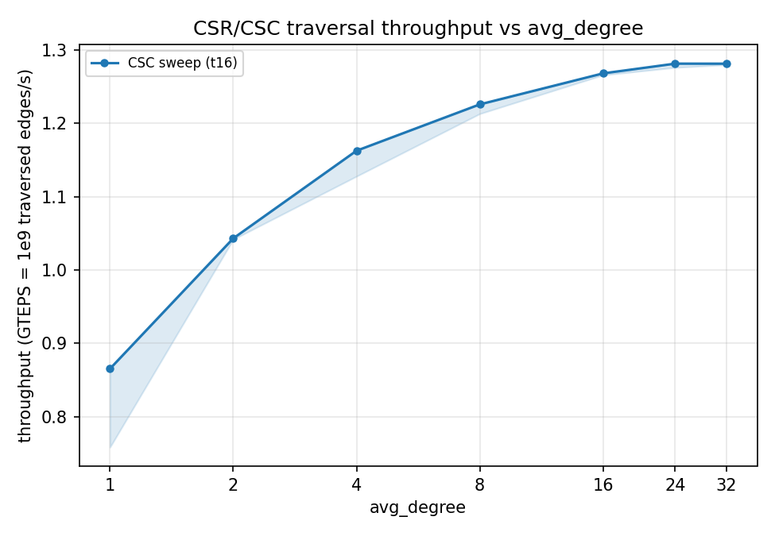
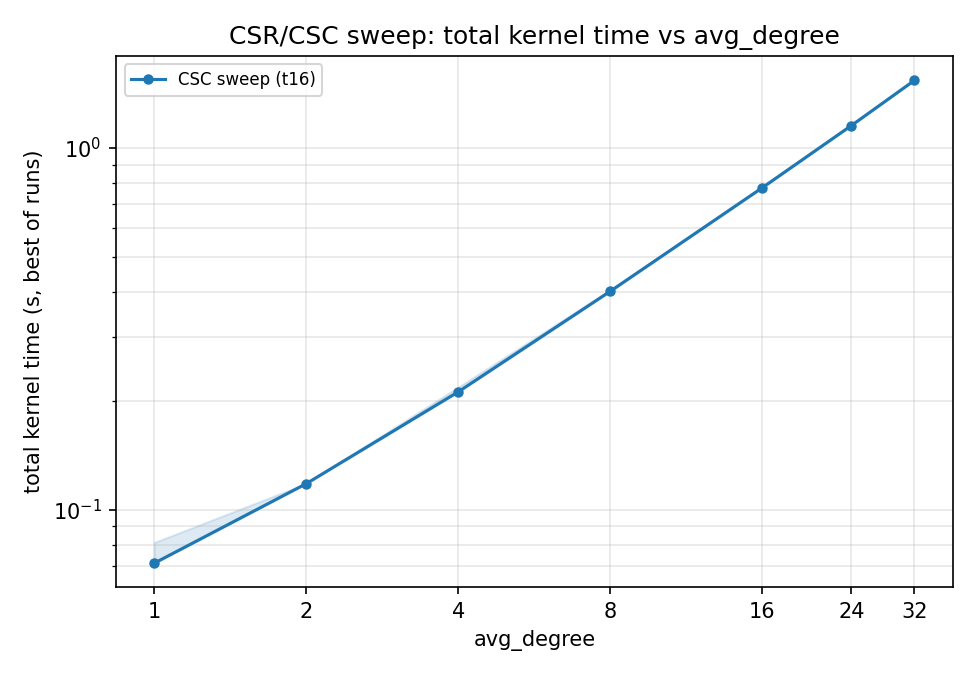

# README

## Code Structure

```
driver.c ── main(): orchestration mainly: parse args, loop the degree grid,
   │                check the memory guard, build the graph, call the
   │                kernel's timer, emit one CSV row per run
   │
   ├── cli.c                              parse_args: argv to config_t for the sweep (degrees, threads, pin list)
   ├── graph_generator.c [MODS NEEDED]    build_csr / build_csc: generate random edges, and build CSR/CSC arrays [Mods: Accelerator-specific alloc, flush and free]
   ├── csr_sweep_push_st.c [MODS NEEDED]  PUSH kernel + timer: single-thread scatter random indirect writes,
   │                                      vprop[indirect-idx]++, returns TSC cycles (pins core) [Mods: Accelerator-specific indirect access functions (L31-33)]
   ├── csc_sweep_pull_mt.c [MODS NEEDED]  PULL kernel + timer: OpenMP gather random indirect reads,
   │                                      out[v]=Σ vprop[indirect-idx], returns TSC cycles (pins cores) [Mods: Accelerator-specific indirect access functions (L50-53)]
   ├── csr_sweep_utils.c  prefault pages, calibrate TSC GHz, memory_guard_ok
   └── csv_writer.c       csv_write_header / csv_write_row: unified result schema
            │
   csr_sweep.h: shared header, graph_t types + every module's prototypes,
                  included by all .c files
```

## Build

Once the changes are done, we can use the `Makefile` to build the benchmark

```bash
make -j4
```

## CLI

Run `./driver` directly. One invocation sweeps **one** kernel (`-kernel push` or `-kernel pull`) over the `-k` avg-degree grid at fixed `-V`, timing `-r` runs per point and writing a CSV to stdout (or `-o`).

```bash
# push (single-thread scatter, CSR), degrees 8 and 16, 3 runs, pin to core 0
./driver -V 100000 -kernel push -k 8 -k 16 -r 3 -s 42 -c 0

# pull (multi-thread gather, CSC), degree 16, swept over a thread axis pinned to cores 0,2,4,6
./driver -V 100000 -kernel pull -k 16 -t 1 -t 2 -t 4 -c 0 -c 2 -c 4 -c 6 -o out.csv

# pull (multi-thread gather, CSC), degree 16, unpinned sweep over 16 threads
./driver -V 100000 -kernel pull -k 16 -t 16  -o out.csv
```

| Flag | Meaning | Default |
|------|---------|---------|
| `-V <vertices>` | Vertex count, fixed for the sweep | `61000000` |
| `-k <avg_degree>` | nominal `E = V*avg_degree`, Repeatable | grid `1,2,4,8,16,24,32` |
| `-kernel push\|pull` | Which kernel to sweep | `push` |
| `-t <threads>` |  pull thread-count axis (ignored for push), Repeatable | `{1}` |
| `-dist urand` | Edge distribution (only `urand` today) | `urand` |
| `-r <runs>` | Timed runs per point | `5` |
| `-s <seed>` | splitmix64 seed | `42` |
| `-c <cpu>` | cores to pin. Push uses the first; pull pins thread `i` to the `i`-th `-c` (give ≥ threads, ideally distinct physical cores). No `-c` → no pinning. Repeatable | none |
| `-o <out.csv>` | Output file (truncates) | stdout |

To bind to specific numa nodes, we would have to use 
```bash
numactl --cpunodebind=X --membind=X ./driver ...
```

## Helper scripts

Wrapper around `driver` to benchmark computations for **Billion-scale graphs**.
Driver is run with `numactl --cpunodebind=0 --membind=0` to keep memory node-local. Each script builds the driver and writes a CSV in the `results/` directory.

```bash
# serial push baseline
./csr_serial_push_sweeper.sh [OUT.csv]

# parallel pull sweep
./csc_parallel_pull_sweeper.sh [-p|--pin] [-o|--output OUT.csv]
```

Defaults per mode:

| | `csr_serial_push_sweeper.sh` (push) | `csc_parallel_pull_sweeper.sh` (pull) |
|------|------|------|
| `V` | 61,578,415 | 61,578,415 |
| degree grid (`-k`) | `1,2,4,8,16,24,32` | `1,2,4,8,16,24,32` |
| threads (`-t`) | 1 | 16 |
| pinning (`-c`) | core 0 (always) | none by default. `-p`/`--pin` → cores 0,2,…,30 |
| runs (`-r`) | 5 | 5 |
| seed (`-s`) | 42 | 42 |
| output | `results/csr_push_twitter_scale.csv` | `results/csc_pull_twitter_scale_t_16.csv` |

## Results

The benchmark will be used to estimate the lower bound of expected speedup using the accelerator. The results are used to compute TEPS (traversed edges per second) and total kernel time as the number of edges processed increase.
```csv
# Example CSV: Pull_CSC_Sweep
V,avg_degree,dist,kernel,threads,actual_E,run_idx,seed,cycles,ns,ns_per_access
61578415,1,urand,pull,16,61578415,0,42,191014294,73639785.230,1.195870
61578415,1,urand,pull,16,61578415,1,42,184658664,71189564.263,1.156080
61578415,1,urand,pull,16,61578415,2,42,184707886,71208540.317,1.156388
61578415,1,urand,pull,16,61578415,3,42,210647446,81208753.324,1.318786
61578415,1,urand,pull,16,61578415,4,42,184598192,71166251.112,1.155701
61578415,2,urand,pull,16,123156828,0,42,308267076,118843049.883,0.964973
61578415,2,urand,pull,16,123156828,1,42,306280742,118077278.871,0.958755
61578415,2,urand,pull,16,123156828,2,42,306317796,118091563.920,0.958871
61578415,2,urand,pull,16,123156828,3,42,306680650,118231451.308,0.960007
61578415,2,urand,pull,16,123156828,4,42,306581154,118193093.634,0.959696
61578415,4,urand,pull,16,246313645,0,42,551854584,212750848.081,0.863740
...
```

Example plots for the pull/CSC t16 sweep above — throughput (TEPS) and total kernel time:





## What does the code do

This code generates a uniform random graph (directed) with given Vertices `V`, edges `actual_E` (based on removal of self loops and parallel edges from the randomly generated graph) and avg_degree `k`, then runs a sweep across all the edges by two methods:

1. Single-threaded push-style [Indirect random reads and writes].
2. Multi-threaded pull-style [Indirect random reads].

This sweep is performed `r` times, while the time around the sweeps is recorded and reported in the csv.
